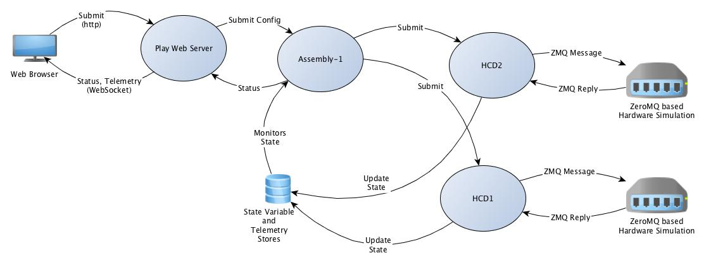

Java CSW Command Service Package Demo
=====================================

#### Note: This project is not currently up to date with the csw master branch. It will be updated later.

This project contains standalone Java applications for testing the command service
Container, Assembly and HCD components and is based on
the document "OSW TN009 - TMT CSW PACKAGING SOFTWARE DESIGN DOCUMENT".

Dependencies
------------

This project depends on the csw project, so you should run install.sh there in order to
install the necessary jars.

To use the web app, you need to run install.sh in csw-play-demo as well.

This project also assumes that redis-server is running (http://redis.io/).

Subprojects
----------

* assembly1Java - an example assembly
* hcd2Java - an example HCD
* container1Java - an example container for assembly1
* container2Java - an example container for a number of instances of hcd2

Note that assembly1 and hcd2 are both _components_ and can also be run standalone using generated scripts
(under target/universal/stage/bin).

A container can include multiple components. The container1 example wraps the assembly1 component while the
container2 demo wraps multiple hcd2 instances.

The scripts directory also contains the scripts container1s and container2s to demonstrate how to
dynamically configure and run containers.

Sbt Build
---------

To compile, run ./install.sh to create an install directory (../install) containing all the necessary scripts and jar files.

Run the demo
------------

To run the demo, there are a number of alternative scripts provided (installed under ../install/bin):

* java_test_containers.sh - runs the hardware simulation code, the location service and the two containers

* java_test_components.sh - does the same as above, but runs the assembly and HCDs in standalone mode, without a container

* java_test_dynamic_containers.sh - does the same as above, but creates the containers on the fly using a
  [scalas](http://www.scala-sbt.org/0.13/docs/Scripts.html)
  script and config files for the containers

* java_test_containers_with_config_service.sh - does the same as above, but in this case the containers get the
  configurations from the config service, which is started in the script

Test with the web app
---------------------

To use the web app, first make sure you have installed it by running install.sh in
the csw-play-demo project. Then run:

    demowebserver

Open http://localhost:9000 in a browser for the web interface.

Select filter and disperser values in the form and press Apply.
The status of the command is shown below the button and updated
while the command is running.

The list of numbers below each item displays the telemetry that the app receives from
the server and indicates that the filter or disperser wheel is moving past
the different positions.

The HCDs both talk to the C/ZeroMQ based hardware simulation code and then set state
variables to indicate the current state of the hardware. The assembly monitors these
variables to determine when the config has been matched, so it can send the command
status back to the requester (the web app in this case).

The following diagram shows the relationships of the various assemblies and HCDs in this demo:

